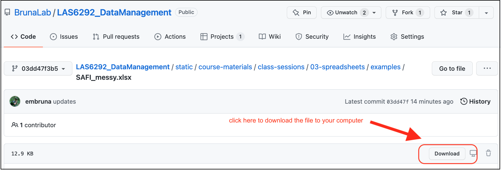

---
# author:
#   - name: Emilio M. Bruna
#     affiliations:
#       - id: uf
#       - name: University of Florida
title-block-style: default
date-modified: last-modified
execute:
  echo: false
---


<!-- ```{r} -->
<!-- #|echo: false -->
<!-- #|warning: false -->
<!-- library(knitr) -->
<!-- library(rmdformats) -->

<!-- ## Global options -->
<!-- options(max.print="75") -->
<!-- opts_chunk$set(echo=FALSE, -->
<!-- 	             cache=TRUE, -->
<!--                prompt=FALSE, -->
<!--                tidy=TRUE, -->
<!--                comment=NA, -->
<!--                message=FALSE, -->
<!--                warning=FALSE) -->
<!-- opts_knit$set(width=75) -->
<!-- ``` -->

# Data Organization in Spreadsheets: In-class Activities {.unnumbered}


## **Breakout 1: Group Discussion** 

Much of your future as a researcher will be spent cleaning and correcting data, but you can reduce the time spent on this task (and the associated stress) considerably by implementing some good practices from the start. To start developing these good habits we will to take a look at some spreadsheets, identify the things that people should **_not_** be doing with them, and then determining what they should be doing instead.


1. Download the following three spreadsheets. To download the files, click the links and then the `download` button (shown below) on the right-hand side.  

{width=50%}

  * `SAFI_messy.xlsx`: [download link](https://github.com/BrunaLab/LAS6292_DataManagement/blob/03dd47f3b52a9bf32be643cf34bafcce6566e555/content/instructor-materials/class-sessions/03-spreadsheets/examples/SAFI_messy.xlsx).
  * `unity-portal-data.xlsx`: [download link](https://github.com/BrunaLab/LAS6292_DataManagement/blob/03dd47f3b52a9bf32be643cf34bafcce6566e555/content/instructor-materials/class-sessions/03-spreadsheets/examples/untidy-portal-data.xlsx).
  * `dates.xlsx`: {download link](https://github.com/BrunaLab/LAS6292_DataManagement/blob/03dd47f3b52a9bf32be643cf34bafcce6566e555/content/instructor-materials/class-sessions/03-spreadsheets/examples/dates.xlsx)
  

2. Open `SAFI_messy.xlsx` and look at how the data are have been entered and organized. Now discuss the following questions. Keep in mind the `tidy` principles about which you read in Broman and Woo (2018).

a. What problems can you identify with the way these data are entered/organized?
    
b. How would you correct each of these issues? Could these data easily be imported into a programming language or a database in its current form?

3. Do the same with `unity-portal-data.xlsx`: review the data and discuss questions a & b.

4. Dates, or things that look like dates, are especially problematic in Excel. Open the file `dates.xlsx` and enter the following dates into the column labeled `date_1`. Be sure to type them in exactly as they are written:
    
    * `7-2-21`
    * `2 july 2021`
    * `july 2, 2021`
    * `july 2,2021` [no space between the comma and 2021]
    * `07-02-21`
    * `7/2/21`
    * `Jan 5, 1900`
    * `Dec 5, 1899`
  
    a. Is the value in the cell the same as what you typed in?
    b. Why would these issues be a problem for data organization and analysis? 
    
5. Next enter the dates above into the column labeled `date_2`. Again, be sure to type them in exactly as they are written.
    
    a. what was different about the way the data are recorded? 
    b. can you figure out why?
  
  
6. What would you do to enter dates into Excel in a way that avoids the issues observed above? 

7. Export the `SAFI_messy.xlsx` as a .csv file with the name `SAFI_messy.csv`; you'll have to click the "OK" when warning box pops up.  Now reopen it. What happened? You can find a guide to saving your file in .csv format and why that is a good idea [on this website](https://datacarpentry.org/spreadsheet-ecology-lesson/05-exporting-data/index.html).

## **Breakout 1: Returning results**   

**Alternating between groups, guide groups to the following best practices: **

   * Make your data `tidy`
      * Spreadsheets should be a rectangle, with only rows and columns.
      * Each column is a different variable (a thing you are measuring, like ‘weight’ or ‘temperature’).
      * One row per observation. Each cell has only one value.
   * Column headers: Use short meaningful column names with no spaces or special characters. Don't start column names with numbers. Record units in column headers.
   * Use consistent names, abbreviations/codes, and capitalization.
   * Use good null values (not -999, blanks ok, some prefer `NA` or similar but this can be language specific).
   * Write dates as YYYYMMDD. Better still have separate columns for Year, Month, and Day.
   * don't enter the same data on multiple spreadsheets: Use one for each category of data to avoid duplicated data and to simplify corrections (e.g., taxonomy).
  * Avoid using multiple tables within one spreadsheet.
  * Avoid spreading data across multiple tabs (but do use a new tab to record data cleaning or manipulations).
  * Record zeros as zeros.
  * Use an appropriate null value to record missing data.
  * Don’t use formatting to convey information or to make your spreadsheet look pretty.
  * Excel is unable to parse dates from before 1899-12-31. Be careful if your data include a mix of pre/post….you’ll have mixed data types.
  * Remember that data format and excel defaults can vary by region. For example, depending on the part of the world where a user is based, the default value for the decimal and thousands operator could be a `,` (comma) or a `.` (period); some regions use mm-dd for dates while others use dd-mm. 


  * **NB:** The reason dates in Excel are so weird is that it is _accounting software_. It counts the days from a default of December 31, 1899, and thus stores July 2, 2014 as the serial number 41822. This is so one can can easily calclulate "days from a given date" for accounting purposes (like invoicing) by adding "date+XX days".         * Furthermore, Excel is unable to parse dates from before 1899-12-31. Be careful if your data include a mix of pre/post….you’ll have mixed data types.


## **Take-home Messages** 

1. **Once you are done with data entry, save it as 'read only' and make _all_ corrections using scripting!**

2. **Entering data in tidy format will make it much easier to analyze.**  

3. **Collecting data in tidy format makes it easier to enter data in tidy format.**   
     
     
## **In-class Group Assignment**

**The goal of this breakout** is to learn some ways to minimize the number of mistakes when entering data. **First**, watch the following video (11 min) on ['Data Validation in Excel'](https://www.youtube.com/watch?v=nMxl1_NAcxc). **Second**, open this web page on ['Quality Assurance and Control in Excel'](https://datacarpentry.org/spreadsheet-ecology-lesson/04-quality-control.html). It covers the same material, so it's a handy reference to have open during the exercise. (*Note: while we are using Excel for this exercise, see "Tools" below for how to do the same in Google Sheets*).   

### **Exercise: ** Set up a `tidy` sheet for data entry for the Portal data from Breakout 1  {.unnumbered}

1. Create a spreadsheet in Excel for data entry. It should have five columns, in which you will be recording (1) the date of observations,  (2) the site in which the observations were conducted, (3) the species captured, (4) the mass of each animal, and (5) the length of each animal. 

2. Set the following data validation criteria to prevent invalid data from getting entered:

    a. The Date column should be set so that it does *not* convert dates to other formats.
    b. Use data validation so that Site can only be one of the following A1, A2, B1, B2. 
    c. Set the error message on this validation criteria to provide information on what the valid values are.
    c. Use data validation so that Species can only be one of the following: *Dipodomys spectabilis*, *Dipodomys ordii*, *Dipodomys merriami*. 
    d. Set the error message on this validation criteria to provide information on what the valid values are.
    d. Use data validation so that Mass can only be a decimal greater than or equal to zero but less than or equal to 500. 
    e. Set the error message on this validation criteria to provide information on what the valid values are.
    f. Length should be an integer (i.e., a whole number) between 1 and 10. 
    g. Set the error message on this validation criteria to provide information on what the valid values are.

3. Check that the validation rules and data formatting are working by entering some data in the cells

4. Save this file as `data_entry_form.xlsx` and submit it via the Canvas website as 'homework-wk3'.

### Grading Rubric:  {.unnumbered}

Assignment completed with data validation correctly programmed with useful error messages: 50
Most data validation properly programmed; some require instructor follow-up: 40
Many of the validation parameters need corrections, error messages not useful: 30
Incorrect data are able to be entered in all categories; Instructor follow-up required: 20


 


