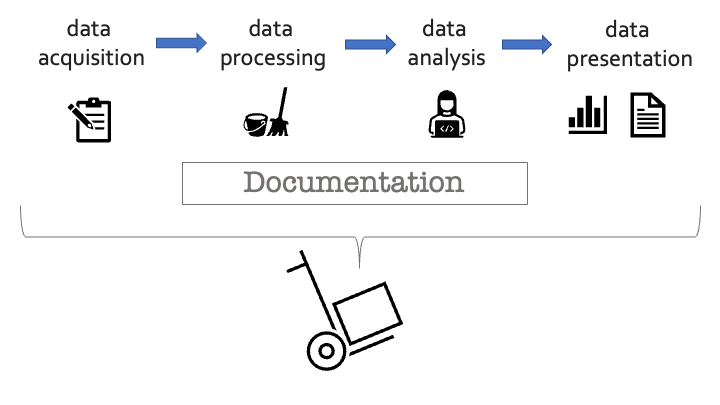
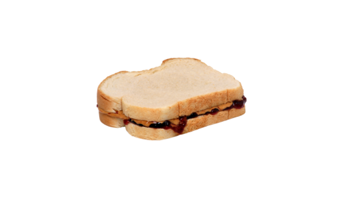

## 

&nbsp;
&nbsp;
&nbsp;
&nbsp;
&nbsp;
&nbsp;

<h3 style="color:navy" align="center">Why should we practice</h3>
<h3 style="color:navy" align="center">‘Reproducible Research’?</h3>

## Why 'Reproducible Research'?  {.smaller}

- Have you ever tried to reproduce someone else's data analysis? 

- Have you ever tried to repeat your _own_ (old) work?

- What made it easy/hard to do so?

- What would have to happen if you had to extend the analysis further?

- If you caught a data error how easy/hard would it be to re-create the analysis?

- What would happen if your collaborator is no longer available to walk you through their analysis? 

- What if _you_ couldn’t remember the steps?

## A Data Sharing Snafu in 3 Acts  {.smaller}



## Why 'Reproducible Research'?

**Scientific Integrity:** 

  - Rigor, trustworthiness, and transparency
  - Allows others to verify analyses, find & correct mistakes

**Efficient Research:**

  - Helps remember _HOW_ and _WHY_ you did something.

  - Speed up _this_ project: Automation makes it faster (and easier) to redo analyses. Time saved can be spent doing other stuff.

  - Speed up _future_ projects: Can use scripts from one project for another one.

**Community Good:**

 - Others can learn from your approach & methods

## 

{fig-align="center" width="60%" fig-alt="reproducible workflow: data aquisition, data processing, data analysis, data presentation."}  

## 

#### Reproducible Data Processing: _Let's Practice_ 

{fig-align="center" width="60%" fig-alt="picture of a peanut butter and jelly sandwich."}   

## Reproducibility = Recipies

{fig-align="center" width="50%" fig-alt="picture of the recipie for the classic mexican dish 'mole poblano'"}   

## 

{fig-align="center" width="60%" fig-alt="picture of a peanut butter and jelly sandwich."}   

