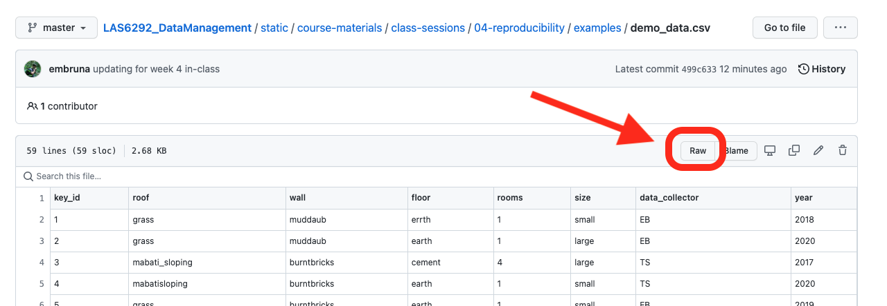

---
# author:
#   - name: Emilio M. Bruna
#     affiliations:
#       - id: uf
#       - name: University of Florida
title-block-style: default
date-modified: last-modified
execute:
  echo: false
---

# Reproducible Data Correction with R

## Download the data we will be using in class

1. Open the messy data file `demo_data.csv` by following [this link](https://raw.githubusercontent.com/BrunaLab/LAS6292_DataCourseBook/refs/heads/main/class_materials/class_sessions/04_reproducibility/examples/demo_data.csv)
1. the data will open as a tab in your web browser in `.csv` format; save them to the `data_raw` folder by going to 'File' on the menu bar of your web browser and selecting 'Save page as' from the drop-down menu.
1. save the file to the `data_raw` folder. 

<!-- {width=50%} -->

## Data Cleaning: Practice

1. Review the `.csv` file 
2. What things do you see that need to be corrected? 
3. Make a list of the what you think needs to be corrected and the steps necessary to identify and implement each correction. Some of the things to look out for include: 
    
    * Numeric values stored as character data types
    * Factors stred as characters
    * Duplicate rows
    * Spelling mistakes
    * inconsistent formatting (eg., codes, capitalizations)
    * White spaces
    * Missing data
    * Zeros instead of null values
    * Special characters (e.g. commas in numeric values instead of decimals)
    * column headings with spaces between words or that start with numerals 

4. Write R code to implement the changes you have identified

5. Save this code as `las_practice.r` and submit it via the Canvas website.

### Grading Rubric:  {.unnumbered}

Assignment completed with data validation correctly programmed with useful error messages: 35
Most data validation properly programmed; some require instructor follow-up: 25
Many of the validation parameters need corrections, error messages not useful: 15
Incorrect data are able to be entered in all categories; Instructor follow-up required: 10

 

