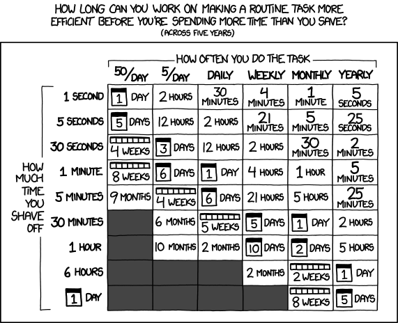

---
# author:
#   - name: Emilio M. Bruna
#     affiliations:
#       - id: uf
#       - name: University of Florida
title-block-style: default
date-modified: last-modified

---

# Automated Data Collection & Extraction {#sec-automated}

Automating your data collection is one of the best ways to make your research more efficient and rfree up time to dso other things. Some of these techniques take time to learn, but so take into account the time required to learn a method and the return on investment for the effort. 

[]{fig-align="center"}

::: {.callout-tip title="AI and Automated Data Extraction"}

Automated data extraction is a rapidly changing field due to advances in machine learning and other 'AI' tools. The list below will be changing frequently to reflect these advances, but working through some of these methods by hand is an excellent to way to evaluate what these tools can and can't do for your research.

:::

## APIs

1. Isabella Velásquez: Creating APIs for Data Science With `plumber`: [[link](https://posit.co/blog/creating-apis-for-data-science-with-plumber)]

- [`plumbr`]https://www.rplumber.io/index.html package

1. SESYNC: Data APIs in R Lesson [[link](https://www.sesync.org/resources/data-apis-r-lesson)]

1. The Carpentries: APIs with R [[link](https://kubdatalab.github.io/R-api/)]
1. Md Sakhawat Hossen: Working with the APIs (Application Programming Interfaces) in R [[link](https://rpubs.com/sakhawat3003/922199)]

## Optical Character Recognition

1. Video Primer: [What is OCR?](https://www.youtube.com/watch?v=Q5U_VEmcY-M)

### Online OCR Tools (text & data from `.pdf` to `.csv`, `.txt`, etc.) {.unnumbered}

1. Google Drive - Video Primer: [OCR with Google Drive](https://www.youtube.com/watch?v=4lApeCNK6Ic)
1. Free online sites for small batches (can upgrade for larger numbers of files)
  
   > * [Free Online OCR 1](http://www.free-online-ocr.com/)
   > * [New OCR](https://www.newocr.com/)
   > * [pdf to excel](https://smallpdf.com/pdf-to-excel)
   > * [OnlineOCR](https://www.onlineocr.net/)
   > * [PDFTables](https://pdftables.com/) will convert PDF to .csv, and has an [API](https://pdftables.com/blog/convert-pdf-to-excel-r) so you can do your conversions in bulk with R. You can do ~25 pages free; large numbers are reasonably priced.
    
1. [Amazon TextExtract](https://aws.amazon.com/pm/textract)

1. [Mathpix Snip](https://mathpix.com/) digitizes handwritten or printed text, and copies outputs to the clipboard that can be pasted into LaTeX editors like Overleaf, Markdown editors like Typora, Microsoft Word, and more. 
  
### OCR with R  {.unnumbered}

<!-- , and `pdfreader` -->

1. R package [`pdftools`](https://cran.r-project.org/web/packages/pdftools/index.html)
1. R package [`tabulapdf`](https://github.com/ropensci/tabulapdf)
    <!-- * R package [`pdfreader`](https://github.com/ropensci/tabulapdf) -->
1. [written tutorial 1](http://theautomatic.net/2018/08/24/getting-data-from-pdfs-the-easy-way-with-r/)
1. [written tutorial 2](https://www.charlesbordet.com/en/extract-pdf/#)
1. [written tutorial 3](https://datascienceplus.com/extracting-tables-from-pdfs-in-r-using-the-tabulizer-package/)
1. [Video Tutorial 1](https://www.youtube.com/watch?v=DhY3V4LCdps)
1. [Video Tutorial 2](https://www.youtube.com/watch?v=6ItyOgS2noc)
1. Detailed [Blog Post / Tutorial](https://datascienceplus.com/extracting-tables-from-pdfs-in-r-using-the-tabulizer-package/)
1. [Convert PDF to text in R OCR pdftools](https://www.youtube.com/watch?v=DhY3V4LCdps)
1. [PDFtools in R](https://www.youtube.com/watch?v=6ItyOgS2noc )
    
1. More advanced but more powerful from the Programming Historian: [OCR with Google Vision API and Tesseract](https://programminghistorian.org/en/lessons/ocr-with-google-vision-and-tesseract)
    
## Extracting tables from images with R  

1. R package [`magick`](https://cran.r-project.org/web/packages/magick/vignettes/intro.html) _(this package actually includes several very powerful tools for image processing; this is just one of the things you can do with it)_
1. Detailed [Blog Post / Tutorial](https://themockup.blog/posts/2021-01-18-reading-tables-from-images-with-magick/)

## Extracting Data from Published Figures

1. Ankit Rohagni's [Web Plot Digitizer](https://automeris.io/WebPlotDigitizer/)
   * WPD [Video Tutorial](https://www.youtube.com/watch?v=P7GbGdMvopU)
   * WPD Tutorial [Blog Post](https://towardsdatascience.com/unlocking-data-from-graphs-how-to-digitise-plots-and-figures-with-webplotdigitizer-2dad17e6e073/)  

1. Alternative 1: R package [`magick`](https://www.r-bloggers.com/2019/06/extracting-the-data-from-static-images-of-graphs-with-magick/)  

1. Alternative 2: [GetData](http://www.getdata-graph-digitizer.com/index.php) extracts data automatically from scanned images (~$30).  

1. Alternative 3: R package [`digitize`](https://github.com/tpoisot/digitize/) will extract data from scatterplots within the R environment. _Note that this is no longer on CRAN due to dependency issues but you can still install and try to work with it directly from the Github repository._ 
<!-- [This article](https://journal.r-project.org/archive/2011-1/RJournal_2011-1_Poisot.pdf) will walk you through the process. -->

1. A more comprehensive overview: Brauckhoff, et al., "Exploring Image Analysis in R: Applications and Advancements", The R Journal, 2025 [[link](https://journal.r-project.org/articles/RJ-2025-030/)]

## Text Mining  

1. [Text Mining with R](https://www.tidytextmining.com/) by Julia Silge and David Robinson

1. [`gutenbergr`](https://cran.r-project.org/web/packages/gutenbergr/index.html): Download and Process Public Domain Works from [Project Gutenberg](https://www.gutenberg.org/). Tutorial can be found [here](https://docs.ropensci.org/gutenbergr/)

### Useful reading on text mining {.unnumbered}

1. Atanassova I, Bertin M and Mayr P (2019) Editorial: Mining Scientific Papers: NLP-enhanced Bibliometrics. Front. Res. Metr. Anal. 4:2. [doi: 10.3389/frma.2019.00002](https://www.frontiersin.org/articles/10.3389/frma.2019.00002/full)

1. Westergaard D, Stærfeldt H-H, Tønsberg C, Jensen LJ, Brunak S (2018) A comprehensive and quantitative comparison of text-mining in 15 million full-text articles versus their corresponding abstracts. PLoS Comput Biol 14(2): e1005962. https://doi.org/10.1371/journal.pcbi.1005962

1. Salloum, S.A., Al-Emran, M., Monem, A.A., Shaalan, K. (2018). Using Text Mining Techniques for Extracting Information from Research Articles. In: Shaalan, K., Hassanien, A., Tolba, F. (eds) Intelligent Natural Language Processing: Trends and Applications. Studies in Computational Intelligence, vol 740. Springer, Cham. https://doi.org/10.1007/978-3-319-67056-0_18

1. Simon, C., Davidsen, K., Hansen, C. et al. BioReader: a text mining tool for performing classification of biomedical literature. BMC Bioinformatics 19, 57 (2019). https://doi.org/10.1186/s12859-019-2607-x

1. Benchimol, J., Kazinnik, S., & Saadon, Y. (2022). Text mining methodologies with R: An application to central bank texts. Machine Learning with Applications, 8, 100286.[link](https://www.econstor.eu/bitstream/10419/323255/3/Text-mining-methodologies-with-R.pdf) 

1. Yu, C., Zhang, C., & Wang, J. (2020). Extracting Body Text from Academic PDF Documents for Text Mining. Proceedings of the 12th International Conference on Knowledge Discovery and Information Retrieval (KDIR 2020). https://www.scitepress.org/Papers/2020/101314/101314.pdf

1. Gulo, C. A., & Rúbio, T. R. (2015, January). Text Mining Scientific Articles using the R. In Doctoral Symposium in Informatics Engineering. [link](https://www.researchgate.net/publication/272417176_Text_Mining_Scientific_Articles_using_the_R_Language?channel=doi&linkId=54e390740cf282dbed6c436c&showFulltext=true#full-text)

## Collecting & Processing data from the Web of Science and Scopus

1. R package [`refsplitr`](https://github.com/ropensci/refsplitr)

1. R package [`bibliometrix`](https://www.bibliometrix.org/)

1. [jstor: An R package for Analysing Scientific Articles](https://www.youtube.com/watch?v=kNRbT-ki9tU) and link to [JSTORr package repository](https://github.com/benmarwick/JSTORr) on Github. _The package is no longer on CRAN but you may still find it useful to browse the repo._
    
    
## Scraping websites 

1. Library Carpentry [Lesson on Webscraping](https://carpentries-incubator.github.io/lc-webscraping/) _Note: no longer updated and a bit out of date, but still a very useful introduction_ 
1. Start Here: [Introduction to webscraping](https://nceas.github.io/oss-lessons/data-liberation/intro-webscraping.html)
1. Video: [Scraping WebData in R with rvest ](https://www.youtube.com/watch?v=4IYfYx4yoAI)
1. Video: [Practical Introduction to Web Scraping using R](https://www.youtube.com/watch?v=l37n_HDD1qs)
1. Very nice [written tutorial](https://www.scrapingbee.com/blog/web-scraping-r/)...
1. ....and another one, this time from the [UC Business Analytics R Programming Guide](http://uc-r.github.io/scraping)
<!-- 1. [scraping HTML text](http://bradleyboehmke.github.io//2015/12/scraping-html-text.html#specific_nodes) and [scraping HTML tables](http://bradleyboehmke.github.io/2015/12/scraping-html-tables.html)  -->
1. [SelectorGadget](https://selectorgadget.com/) is useful to id CSS selectors. 
1. Noortje Marres & Esther Weltevrede (2013) Scraping the Social?, Journal of Cultural Economy, 6:3, 313-335, [DOI:10.1080/17530350.2013.772070](https://www.tandfonline.com/doi/full/10.1080/17530350.2013.772070)

## Cell Phone Data

1. Exploratory analyses [Part 1](https://www.r-bloggers.com/2019/11/exploratory-data-analysis-of-cell-phone-usage-with-r-part-1/) and [Part 2](https://www.r-bloggers.com/2019/12/exploratory-data-analysis-of-cell-phone-usage-with-r-part-2/)

## Social Media Data

1. How to extract Biodiversity Data from Facebook: Chowdhury, S., Ahmed, S., Alam, S., Callaghan, C. T., Das, P., Di Marco, M., Di Minin, E., Jarić, I., Labi, M. M., Rokonuzzaman, Md., Roll, U., Sbragaglia, V., Siddika, A., & Bonn, A. (2024). A protocol for harvesting biodiversity data from Facebook. Conservation Biology, 38, e14257. https://doi.org/10.1111/cobi.14257

1. Di Minin, E., Fink, C., Hausmann, A., Kremer, J. and Kulkarni, R. (2021), How to address data privacy concerns when using social media data in conservation science. Conservation Biology, 35: 437-446. https://doi.org/10.1111/cobi.13708

1. Correia, R.A., Ladle, R., Jarić, I., Malhado, A.C.M., Mittermeier, J.C., Roll, U., Soriano-Redondo, A., Veríssimo, D., Fink, C., Hausmann, A., Guedes-Santos, J., Vardi, R. and Di Minin, E. (2021), Digital data sources and methods for conservation culturomics. Conservation Biology, 35: 398-411. https://doi.org/10.1111/cobi.13706

1. Fox, Nathan, Tom August, Francesca Mancini, Katherine E. Parks, Felix Eigenbrod, James M. Bullock, Louis Sutter, and Laura J. Graham. "“photosearcher” package in R: An accessible and reproducible method for harvesting large datasets from Flickr." SoftwareX 12 (2020): 100624. https://www.sciencedirect.com/science/article/pii/S235271102030337X  

1. Ergon Cugler de Moraes Silva: TelegramScrap: A comprehensive tool for scraping Telegram data. https://arxiv.org/abs/2412.16786

1. Batrinca, B., Treleaven, P.C. Social media analytics: a survey of techniques, tools and platforms. AI & Soc 30, 89–116 (2015). https://doi.org/10.1007/s00146-014-0549-4

<!-- 1. Scraping [Twitter Data with R](https://utstat.toronto.edu/~nathan/teaching/sta4002/Class1/scrapingtwitterinR-NT.html) or with [Tweetsets](https://programminghistorian.org/en/lessons/beginners-guide-to-twitter-data) -->

## Automated Image Analysis

1. Pennekamp, F. and Schtickzelle, N. (2013), Implementing image analysis in laboratory‐based experimental systems for ecology and evolution: a hands‐on guide. Methods Ecol Evol, 4: 483-492. https://doi.org/10.1111/2041-210X.12036 

2. How to build your own image recognition app with R! [Part 1](https://www.r-bloggers.com/2021/03/how-to-build-your-own-image-recognition-app-with-r-part-1/?fbclid=IwAR3P8GNeEHAtm62iOIhhFe45ofZjn-zlwezc5TtM0pbayfUdjmwAr3UoB1Q) and [Part 2](https://www.r-bloggers.com/2021/03/how-to-build-your-own-image-recognition-app-with-r-part-2/)

1. LinkedIn Learning Course: [Deep Learning - Image Recognition](https://careerhub.ufl.edu/classes/deep-learning-image-recognition-2/) reequires UF login 

1. [UF Practicum AI courses](https://it.ufl.edu/rc/get-started/practicum-ai/) include one on Image recognition models.

## Wearable Devices & RFID tags

1. [What is an RFID tag?](https://en.wikipedia.org/wiki/Radio-frequency_identification)

1. Rafiq, K., Appleby, R. G., Edgar, J. P., Radford, C., Smith, B. P., Jordan, N. R., Dexter, C. E., Jones, D. N., Blacker, A. R. F., & Cochrane, M. (2021). WildWID: An open-source active RFID system for wildlife research. Methods in Ecology and Evolution, 12, 1580– 1587. https://doi.org/10.1111/2041-210X.13651

1. [Build your own RFID device](https://news.mongabay.com/2015/07/build-your-own-rfid/)

1. Izmailova, E.S., Wagner, J.A. and Perakslis, E.D. (2018), Wearable Devices in Clinical Trials: Hype and Hypothesis. Clin. Pharmacol. Ther., 104: 42-52. https://doi.org/10.1002/cpt.966

1. Loncar-Turukalo T, Zdravevski E, Machado da Silva J, Chouvarda I, Trajkovik V. Literature on Wearable Technology for Connected Health: Scoping Review of Research Trends, Advances, and Barriers J Med Internet Res 2019;21(9):e14017 [doi: 10.2196/14017](https://www.jmir.org/2019/9/e14017/)

1. [Why Should Sociologists Care about Wearable Tech?](https://www.asanet.org/why-should-sociologists-care-about-wearable-tech)

1. Harari, G. M., Lane, N. D., Wang, R., Crosier, B. S., Campbell, A. T., & Gosling, S. D. (2016). Using Smartphones to Collect Behavioral Data in Psychological Science: Opportunities, Practical Considerations, and Challenges. Perspectives on Psychological Science 11(6), 838-854 https://doi.org/10.1177/1745691616650285 

1. Seifert Alexander, Hofer Matthias, Allemand Mathias. 2018. Mobile Data Collection: Smart, but Not (Yet) Smart Enough. 12. Frontiers in Neuroscience https://www.frontiersin.org/article/10.3389/fnins.2018.00971     

## Buildimg automated data collectors

1.  Calipers that dump data directly to Excel [link](https://www.notion.so/Hacking-Digital-Calipers-3ee7726f11ca431694dc70a1977516e4)  

1. Morris BI, Kittredge MJ, Casey B, Meng O, Chagas AM, Lamparter M, et al. (2022) PiSpy: An affordable, accessible, and flexible imaging platform for the automated observation of organismal biology and behavior. PLoS ONE 17(10): e0276652. https://doi.org/10.1371/journal.pone.0276652

1. Jolles, J. W. (2021). Broad-scale applications of the Raspberry Pi: A review and guide for biologists. Methods in Ecology and Evolution, 12, 1562– 1579. https://doi.org/10.1111/2041-210X.13652

## Online data archives

Overview: Correia, R.A., Ladle, R., Jarić, I., Malhado, A.C.M., Mittermeier, J.C., Roll, U., Soriano‐Redondo, A., Veríssimo, D., Fink, C., Hausmann, A., Guedes‐Santos, J., Vardi, R. and Di Minin, E. (2021), Digital data sources and methods for conservation culturomics. Conservation Biology, 35: 398-411. https://doi.org/10.1111/cobi.13706

### Government data  {.unnumbered}

1. [Data.gov](https://www.data.gov/) (the open data portal of the US Government) and [Using Data.gov APIs in R](https://data.library.virginia.edu/using-data-gov-apis-in-r/)
1. the [rOpengov Project](http://ropengov.org/)
1. [Open Fiscal Data Package](http://www.fiscaltransparency.net/ofdp/) 
1. [`educationdata`](https://urbaninstitute.github.io/education-data-package-r/#educationdata): Retrieve data from the Urban Institute’s Education Data API as a data.frame for easy analysis. See [also here](https://github.com/UrbanInstitute/education-data-package-r)
1. a [huge list](https://cengel.github.io/gearup2016/SULdataAccess.html) of data sources for social scientists available with R tools 
1. accessing [World bank Data](https://vincentarelbundock.github.io/WDI/) with R

### US & World Census Data   {.unnumbered}
  
1. [A Guide to Working with US Census Data in R](https://rconsortium.github.io/censusguide/r-packages-all.html)
1. R Package [`tidycensus`](https://cran.r-project.org/web/packages/tidycensus/tidycensus.pdf)
1. [Tutorial 1](https://walkerke.github.io/tidycensus/articles/basic-usage.html)
1. [Tutorial 2](http://www.computerworld.com/article/3120415/data-analytics/how-to-download-new-census-data-with-r.html rel="nofollow noopener" href="https://hrecht.github.io/censusapi/)
1. R package [`ipumsr`](https://tech.popdata.org/ipumsr/): The ipumsr package helps import IPUMS extracts from the IPUMS website into R. IPUMS provides census and survey data from around the world integrated across time and space. 

### Education Data  {.unnumbered}

1. [`edbuildr`](https://github.com/EdBuild/edbuildr): import [EdBuild’s master dataset](http://viz.edbuild.org/workshops/edbuildr/) of school district finance, student demographics, and community economic indicators for every school district in the United States.

1. [Building R and Stata packages for the Education Data Portal](https://urban-institute.medium.com/building-r-and-stata-packages-for-the-education-data-portal-b88760c07233)

### Other Online Data Portals  {.unnumbered}

1. Giant [compendium of open datasets #1](https://github.com/awesomedata/awesome-public-datasets)
1. [Data on Amazonia](https://datazoomamazonia.com.br/)  
  <!-- https://github.com/Chicago/RSocrata/">RSocrata GitHub repo</a></td> -->
1. R package [`bdc`](https://brunobrr.github.io/bdc/): toolkit for gathering & cleaning biodiversity data

### Software for gathering data from online archives {.unnumbered}

1. [EcoRetriever](https://retriever.readthedocs.io/en/latest/):  automates the tasks of finding, downloading, and cleaning up publicly available ecological data, and then stores them in a local database or csv files. 
1. [litsearcher](https://elizagrames.github.io/litsearchr/)
an R package to facilitate quasi-automatic search strategy development for systematic review

